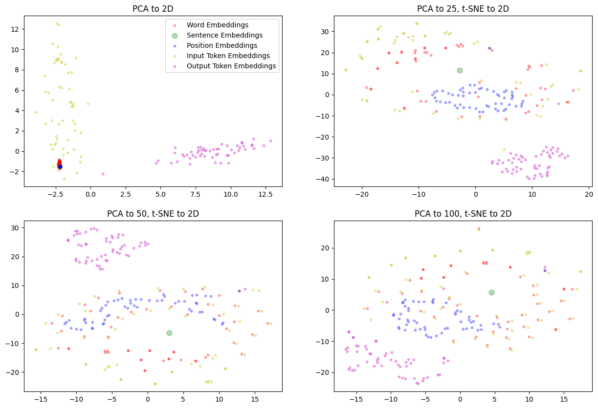

# Amazon Query Matching

This project combines an NLP concepts guide I wrote earlier this year with an application to the [Amazon KDD Cup 2022](https://github.com/amazon-science/esci-data) competition for Improving Product Search.

 

 

**Section 1: Educational Material**

The first section is my article ***NLP Demystified: Exploring Prominent Models, Libraries, and Embedding Space*** where I offer a structured exploration of NLP models, key libraries, dataflow through transformers, and word embedding space.

The guide first clarifies commonly confused terminology, and then explores embedding model architecture types and attributes. It gives and overview of prominent NLP libraries - FastText, SpaCy, and HuggingFace -and then gives a walkthrough of the dataflow through a transformer model and visualizes this mapping in 2D via PCA and T-SNE. Finally, it offers some methods for embedding space comparison and visualization.

 

**Section 2: Improving Product Search**

The second section is an application of the concepts and transformer model in the NLP guide to the Amazon challenge.

In task 1, I map queries and possible product matches to points in BERT's 768 dimension embedding space, and determining rankings via cosine distance. I then compare distance metrics, as well as the use of the SEP token in ranking accuracy.

In task two, I add an output classification layer to BERT's CLS token and experiment with fine tuning this LLM via considerations of the optimizer, learning rate, and using the SEP token to separate product titles and descriptions.